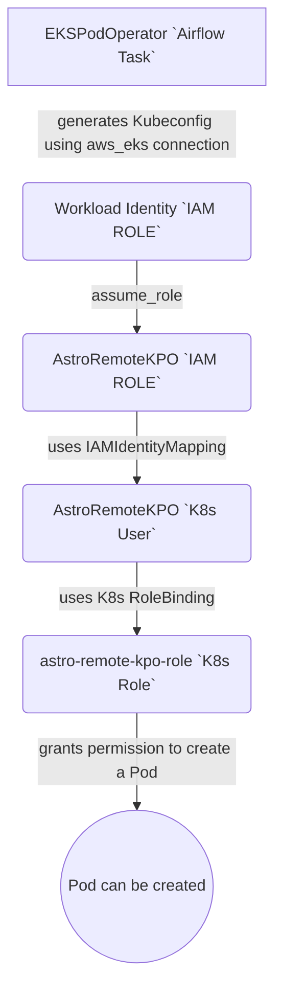

# Instructions

Follow these instructions to set up everything needed to trigger pods on a remote K8s cluster from Airflow.

## Pre-requisites

1. Install eksctl:
   https://eksctl.io/installation/

2. Install kubectl:
   https://kubernetes.io/docs/tasks/tools/#kubectl

3. Install aws cli:
   https://docs.aws.amazon.com/cli/latest/userguide/getting-started-install.html

## Overview

K8s and IAM configuration:
We first create a new EKS cluster and a new namespace. This is where the triggered Pods will be running.
Next, we configure a k8s role and grant it the necessary permissions to trigger pods in this namespace and watch their
execution.

Then we create the IAM Role that will be used by Airflow to connect to the cluster and trigger pods.
The role's trust policy is configured to allow Astro Deployment Workload Identity to assume this IAM Role.
We link the IAM Role to the cluster by updating the aws-auth configmap. A K8s Role Binding is defined to link the IAM
Role's user and the K8s role.
before.
Finally, we ensure that the IAM Role's associated k8s user possesses the necessary permissions to trigger pods.

Airflow configuration:
We provide a DAG to test connectivity to the remote cluster.
Finally, we provide a minimal example of a DAG that triggers the deployment of a pod in the remote cluster.

### Configuring the AWS Connection

Create an AWS connection in the Airflow UI with the following parameters:

* Conn Id: aws_eks
* Conn Type: Amazon Web Services
* Extra: {"region_name": "role_arn": "arn:aws:iam::111122223333:role/AstroRemoteKPO"}

All the other fields are left empty. The Workload Identity of your Deployment will be used to assume the role.

## Authorization chain diagram



## Step-by-step instructions

1. Create a new cluster:
   The cluster.yaml file contains the minimal configuration required.
   We enable the IAM OIDC provider to allow IAM roles to authenticate to our cluster.

    ```
    eksctl create cluster -f k8s/cluster.yaml
    ```

2. List available kube contexts:
   If you have more than one cluster, you can list them and switch between them using the following commands:
    ```
    kubectl config get-contexts
    ```

   Switch to the new cluster if needed:
    ```
    kubectl config use-context remote-kpo-demo
    ```

3. Create a namespace in the cluster:
   This namespace will be used to run the pods triggered by Airflow.
    ```
    kubectl create -f k8s/namespace.yaml
    ```

4. Create a K8s role in the cluster:
   This role will be associated to the IAM Role.
    ```
    kubectl create -f k8s/role.yaml
    ```

5. Create a new IAM Role to connect to the cluster:
   TODO: Scope-down these permissions
    ```
    aws iam create-role --role-name AstroRemoteKPO --assume-role-policy-document file://iam-assume-role-policy.json && \
    aws iam attach-role-policy --policy-arn arn:aws:iam::aws:policy/AmazonEKSWorkerNodePolicy --role-name AstroRemoteKPO && \
    aws iam attach-role-policy --policy-arn arn:aws:iam::aws:policy/AmazonEKS_CNI_Policy --role-name AstroRemoteKPO && \
    aws iam attach-role-policy --policy-arn arn:aws:iam::aws:policy/AmazonEC2ContainerRegistryReadOnly --role-name AstroRemoteKPO
    ```

6. Fetch the role ARN:
    ```
    aws iam get-role --role-name AstroRemoteKPO --query 'Role.Arn' --output text
    ```

7. Update the aws-auth configmap to grant the IAM role access to the cluster:
   Replace the ARN in the following command with the one obtained in the previous step.
    ```
    eksctl create iamidentitymapping --cluster remote-kpo-demo --region=us-east-1 \
        --arn arn:aws:iam::111122223333:role/AstroRemoteKPO --username AstroRemoteKPO \
        --no-duplicate-arns
    ```

8. Verify that the role has been added to the aws-auth configmap:
    ```
    eksctl get iamidentitymapping --cluster remote-kpo-demo --region=us-east-1
    ```

9. Create a role binding in the cluster to link the K8s role to the IAM role:
    ```
    kubectl create -f k8s/role-binding.yaml
    ```

10. Verify that the IAM Role's k8s user has the required permissions to trigger pods in the cluster:
    ```
    kubectl auth can-i create pods --namespace=astro-remote-kpo --as=AstroRemoteKPO
    ```
    The command should return yes if the permissions are correctly set.

## References

- https://docs.aws.amazon.com/eks/latest/userguide/create-cluster.html
- https://docs.aws.amazon.com/eks/latest/userguide/add-user-role.html
- https://docs.astronomer.io/astro/authorize-deployments-to-your-cloud
- https://docs.astronomer.io/learn/kubepod-operator#example-use-kubernetespodoperator-to-run-a-pod-in-a-separate-cluster

- Project Contents
  ================

Your Astro project contains the following files and folders:

- dags: This folder contains the Python files for your Airflow DAGs. By default, this directory includes two example
  DAGs:
    - `remote_kpo`: This DAG shows a simple DAG that triggers a pod in a K8s cluster.
    - `test_eks_connectivity`: This DAG tests connectivity to your EKS cluster. Use it to ensure your Airflow connection
      works before triggering pods in your cluster.
- k8s: This folder contains the Kubernetes manifests for your EKS Cluster.
    - [cluster.yaml](k8s%2Fcluster.yaml) The minimal configuration required to create a new EKS cluster.
    - [iam-assume-role-policy.json](k8s%2Fiam-assume-role-policy.json) The trust policy for the IAM Role that will be
      used by Airflow to connect to the cluster.
    - [namespace.yaml](k8s%2Fnamespace.yaml) The namespace where the pods will be running.
    - [role.yaml](k8s%2Frole.yaml) The K8s role that will be associated to the IAM Role.
    - [role-binding.yaml](k8s%2Frole-binding.yaml) The role binding that links the K8s role to the IAM role.
- Dockerfile: This file contains a versioned Astro Runtime Docker image that provides a differentiated Airflow
  experience. If you want to execute other commands or overrides at runtime, specify them here.
- include: This folder contains any additional files that you want to include as part of your project. It is empty by
  default.
- packages.txt: Install OS-level packages needed for your project by adding them to this file. It is empty by default.
- requirements.txt: Install Python packages needed for your project by adding them to this file. It is empty by default.
- plugins: Add custom or community plugins for your project to this file. It is empty by default.
- airflow_settings.yaml: Use this local-only file to specify Airflow Connections, Variables, and Pools instead of
  entering them in the Airflow UI as you develop DAGs in this project.

Deploy Your Project Locally
===========================

1. Start Airflow on your local machine by running 'astro dev start'.

This command will spin up 4 Docker containers on your machine, each for a different Airflow component:

- Postgres: Airflow's Metadata Database
- Webserver: The Airflow component responsible for rendering the Airflow UI
- Scheduler: The Airflow component responsible for monitoring and triggering tasks
- Triggerer: The Airflow component responsible for triggering deferred tasks

2. Verify that all 4 Docker containers were created by running 'docker ps'.

Note: Running 'astro dev start' will start your project with the Airflow Webserver exposed at port 8080 and Postgres
exposed at port 5432. If you already have either of those ports allocated, you can
either [stop your existing Docker containers or change the port](https://docs.astronomer.io/astro/test-and-troubleshoot-locally#ports-are-not-available).

3. Access the Airflow UI for your local Airflow project. To do so, go to http://localhost:8080/ and log in with 'admin'
   for both your Username and Password.

You should also be able to access your Postgres Database at 'localhost:5432/postgres'.

Deploy Your Project to Astronomer
=================================

If you have an Astronomer account, pushing code to a Deployment on Astronomer is simple. For deploying instructions,
refer to Astronomer documentation: https://docs.astronomer.io/cloud/deploy-code/

Contact
=======

The Astronomer CLI is maintained with love by the Astronomer team. To report a bug or suggest a change, reach out to our
support.
